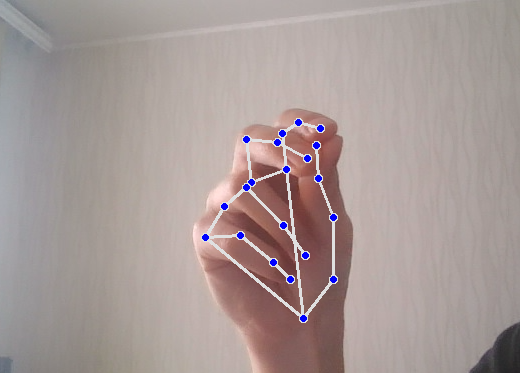
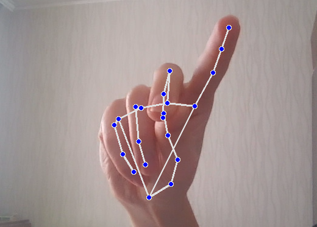
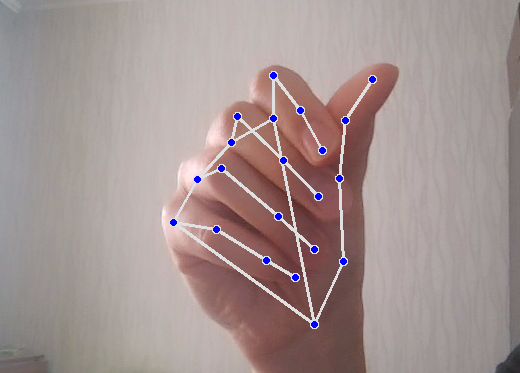
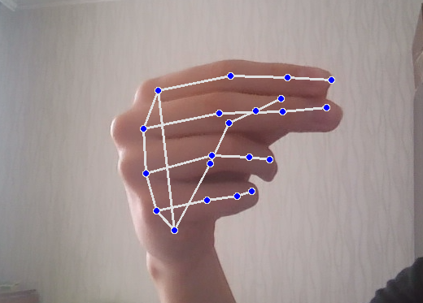

# Gesture Computer Control

[Статья на хабре](https://habr.com/ru/articles/884854/)

This project allows you to control a computer using gestures recognized through the camera. To work with the project, Python 3 and prior installation of the required libraries are required.

## Setting up the Environment

1. Install Python 3 if it is not already installed on your computer.

2. Clone the repository or download the project source code.

3. Open a terminal or command prompt and navigate to the project folder.

4. Install the required dependencies by running the following command:

```bash
pip install -r requirements.txt
```

## Usage

To control the computer using gestures, follow these steps:

1. Run the main project script:

```bash
python gesture_control.py
```

After running, the computer's camera will start recognizing gestures and translating them into control commands.

## Supported Gestures

The following gestures are currently supported in pretrained model:

1. No Action (Default)
2. Cursor Control

  

  This gesture allows you to control the cursor movement on the screen.

3. Left Click

  

  Perform this gesture to simulate a left mouse click.

4. Right Click

  

  This gesture simulates a right mouse click.

5. Scrolling

  

  Use this gesture to scroll vertically on the screen.

## Collecting a Dataset for Training

If you want to expand the functionality or improve the accuracy of gesture recognition, you can collect your own dataset:

1. Modify the codes and names of gestures in the `src\data_utils.py` module as you see fit.

2. Run the script to collect data:

```bash
python create_dataset.py
```

3. In the camera window that appears, perform the gestures you want to add to the dataset. To save the gesture data, press the "Space" key.

## Training the Model

After collecting the dataset, you can train the model on the collected data:

1. Run the model training script:

```bash
python train.py
```

2. In the `train.py` script, you can adjust the training hyperparameters. After training, the model will be saved to the `gesture_model.pth` file.

---

If you have any questions or issues with using the project, refer to the "Issues" section of the repository on GitHub.

## Stuff

python 3.11.9
pip install opencv-python
pip install torch mediapipe numpy pyautogui
pip install pynput